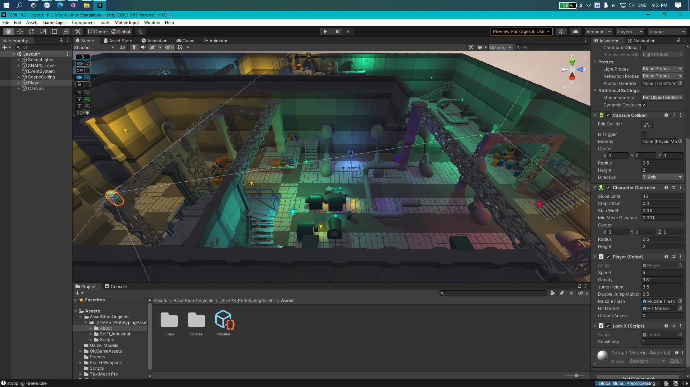

# Báo cáo tuần 1

## Những việc đã làm
- **Xây dựng bản đồ**: Dựa vào assest có sẵn, kết hợp với công cụ pro-grid và pro-builder, nhóm đã xây dựng một phần ban đầu của thế giới trong trò chơi.

- **Tạo dựng nhân vật**. Hiện tại nhân vật mới đang chỉ ở những hình khối rất cơ bản.

- **Xây dựng một số tính năng cơ bản**: Di chuyển, nhảy, bắn súng có đạn thật.

## Kế hoạch tuần tới
- Nâng cấp tính năng cho súng.
- Thêm màn hình bắt đầu game (đang thảo luận ở issue [#3](https://github.com/nnchaubui/SE06-19.2/issues/3))
- Thống nhất với nhau về hướng đi của game (chơi offline hay online, bắn với người hay bắn với zombie...).
