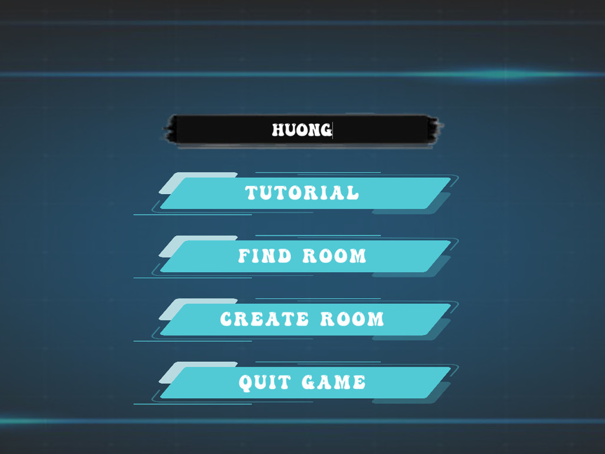

# SE06-19.2
A multiplayer first-person shooter game based on Unity3D. 

# Requirements
1. Unity 2020.3.19f1 (64-bit)
2. Visual Studio 2019
3. GitHub
4. Photon Engine

# Video Demo

# Screenshots

# Binary download

You can download the latest compiled binary here: https://github.com/nnchaubui/SE06-19.2/releases
# Game logic and functionalities

+ Create Room Panel
    - Input your room name and then your player's name will be auto-created.
    - Click **Start Room** to join a room.
+ Find Room Panel
    - Input the room you want to join
    - You will be redirect the room you haved filled in the input panel.
+ Game Interface
    - **Player's HP** is on the top left corner.
    - A **gun (Riffle)** is always shown on the bottom right corner in front of everything you can see.
    - A red **shooting sight** is always in the center of the screen.
    - A **minimap** is always on the top right corner of the screen.

+ Player Movement
    - Walking and Running
    - Jumping
    - Dying

+ Gun Models: There're 4 types of guns which was from **Unity Assets Store**
    - Riffle
    - Sniper
    - Heavy
    - Pistol

+ Networking: This game uses **Photon Unity Networking 2**, which is a good network controller from Unity Assets Store. For the **free version**, it allows upto 20 players to play in real-time.

+ Bullet effects: Bullets hitting materials will cause effects

# Working features
- Multiplayer
- Shooting, Spawning

# Script files
+ Damageable.cs
    - Interface for damageable objects
+ Gun.cs
+ GunInfo.cs
+ Item.cs
+ ItemInfo.cs
+ Launcher.cs
    - Start the network.
    - Create the lobby, Join the lobby.
    - Create Room, Join Room.
    - Start the game, Leave the Game.
    - Update Room Listings.
+ Loading.cs
    - Some loading stuffs.
+ Menu.cs
    - Open and Close Menu.
+ MenuManager.cs
    - Manage Menu Buttons.
+ PlayerController.cs
    - Mangage all player movements (moving, jumping, increse speed...)
+ PlayerGroundCheck.cs
    - Check if the player is on the ground or not.
+ PlayerListItem.cs
    - Setup Player's info.
+ PlayerManager.cs
    - Manage, create player controller when spawning into the game.
+ RoomListItem.cs
    - Setup Room's info.
+ RoomManager.cs
    - Manage, create rooms.
+ SinglerShotGun.cs
    - For Guns' behaviours: shooting, bullet impacts...
+ SpawnManager.cs
    - Manage where the Player's will spawn (by random).
+ SpawnPoint.cs
    - Create Spawnpoints.

# Game Mechanism
Shooting each others until die lol.
 
# Hotkeys
+ WASD: Player Control
+ E: Increse Player Speed
+ 1,2,3,4... or scroll mousewheel: Change betweens guns
+ Space: Jump

# Credits
- Map: https://assetstore.unity.com/packages/3d/environments/industrial/rpg-fps-game-assets-for-pc-mobile-industrial-set-v3-0-101429
- Gun: https://assetstore.unity.com/packages/3d/props/guns/free-fps-weapon-akm-180663
- Photon Engine: https://forum.photonengine.com/

# Special Thanks
- Many many youtube videos.
- Mr.Freddie Nguyen for helping us to know more about Software Engineering.

# Play the Game